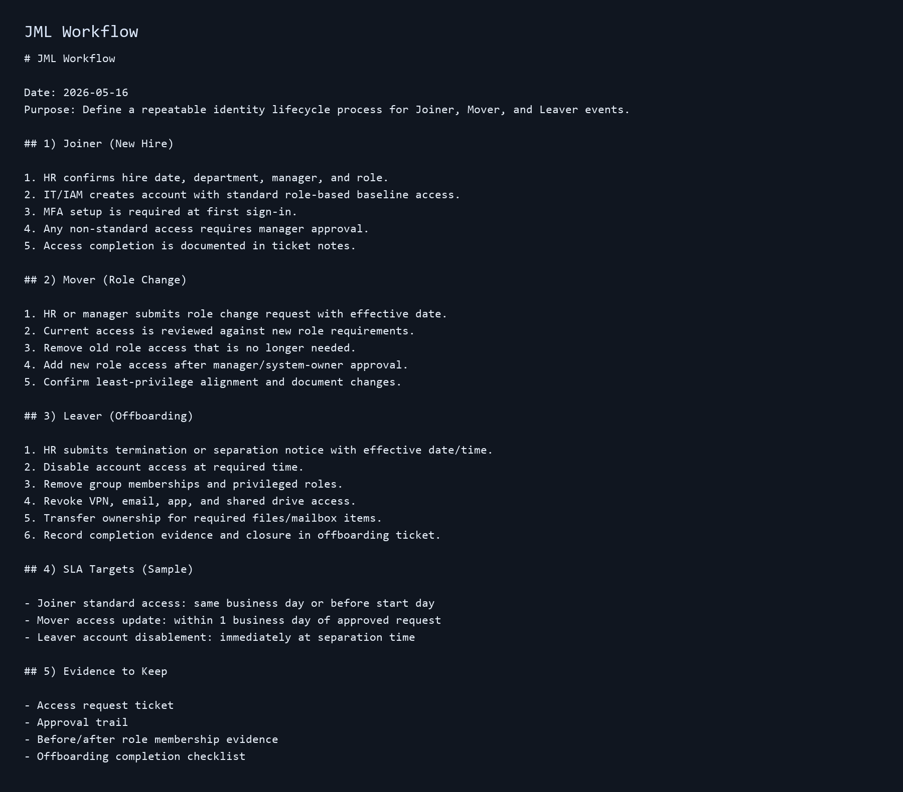
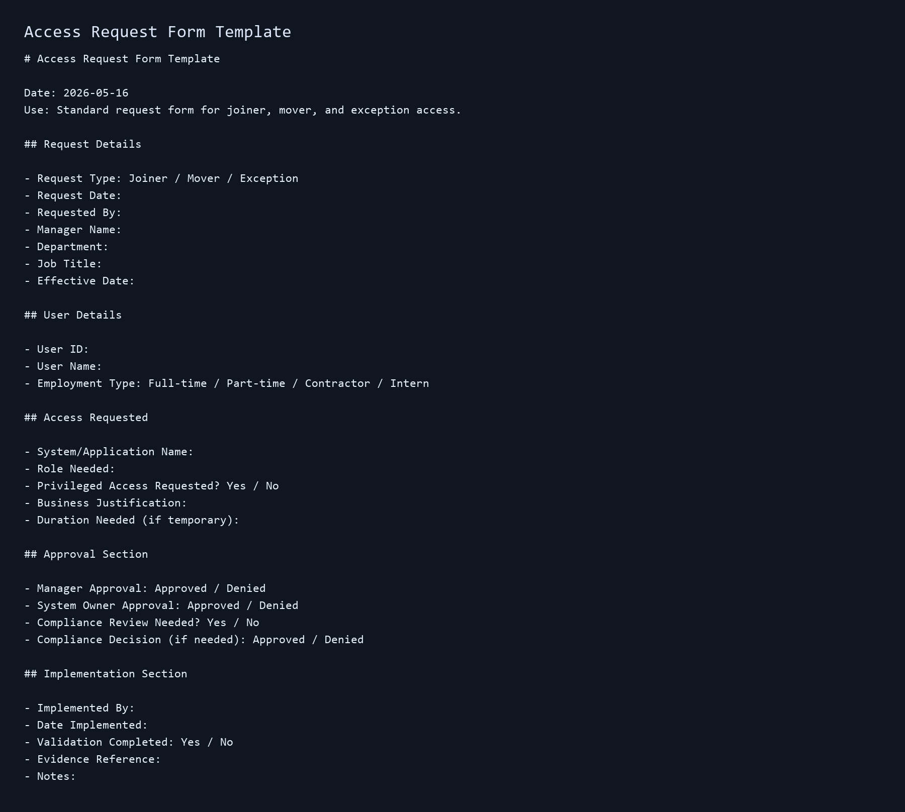
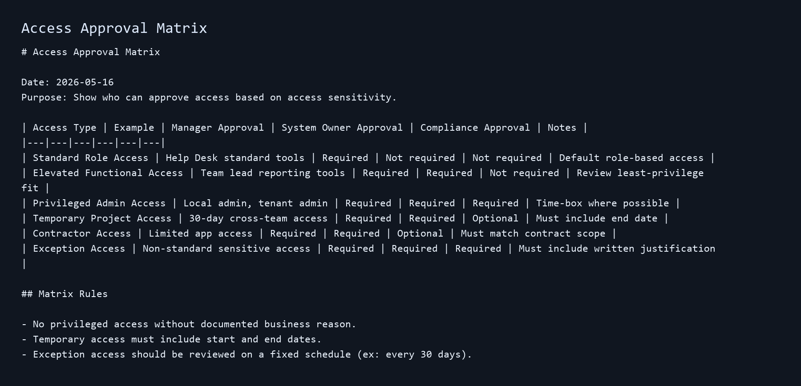
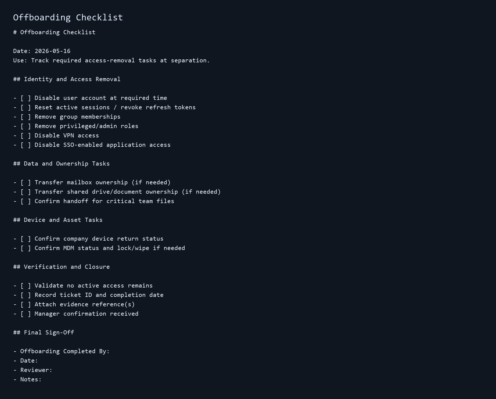
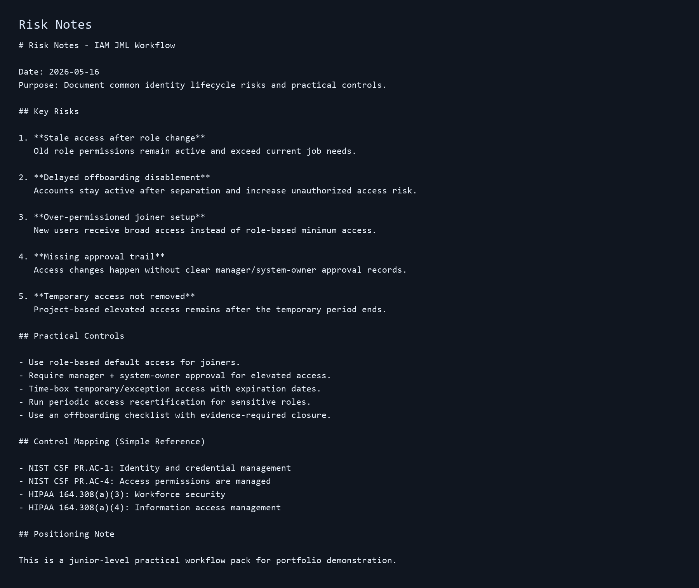

<!-- recruiter-review:start -->
## Recruiter Quick Review

**Best-fit roles:** IT Support Specialist, Help Desk, Desktop Support, IAM Support, Access Management Support, GRC Analyst, IT Compliance, onboarding/offboarding support.

**What this proves:** I can document joiner, mover, and leaver access workflows, connect support tickets to access control, and create repeatable evidence for approvals, offboarding, least privilege, and audit readiness.

**Search keywords:** IAM, joiner mover leaver, JML, onboarding, offboarding, access request, access approval, least privilege, account lifecycle, Active Directory, Entra ID, Microsoft 365, access control, audit evidence, GRC, compliance.

**Start here:** [RECRUITER_REVIEW.md](RECRUITER_REVIEW.md)

**Honest scope:** Portfolio workflow pack using sample process design. This does not claim enterprise IAM ownership or senior identity architecture.
<!-- recruiter-review:end -->

# IAM Joiner-Mover-Leaver (JML) Access Workflow Pack

## Project Purpose

This project shows a simple IAM workflow for onboarding, role changes, and offboarding.

It is built as a junior-level portfolio artifact focused on practical access control documentation.

## What This Pack Covers

- Joiner workflow (new hire access setup)
- Mover workflow (role change access updates)
- Leaver workflow (offboarding and access removal)
- Access request template
- Approval matrix by role and system sensitivity
- Offboarding checklist
- Basic risk notes

## Files

- `JML_WORKFLOW.md`
- `ACCESS_REQUEST_FORM_TEMPLATE.md`
- `ACCESS_APPROVAL_MATRIX.md`
- `OFFBOARDING_CHECKLIST.md`
- `RISK_NOTES.md`
- `screenshots/` (sample visuals of key artifacts)

## Sample Screenshots

## Why This Matters

Weak identity lifecycle controls can lead to over-permissioned accounts, stale access, and audit findings.

A clear JML process supports:

- least privilege
- faster onboarding
- cleaner role transitions
- lower offboarding risk
- better audit readiness

## Scope and Positioning

This is a practical documentation project using sample process design.

It does not claim enterprise IAM ownership or senior architect responsibilities.
